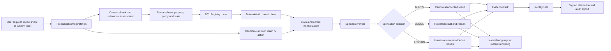

# EcoKure DTL

## Enterprise architecture and EU AI Act implementation guide

**Document status:** public technical reference
**Version:** 1.1
**Date:** 13 August 2026
**Audience:** enterprise architects, AI platform teams, governance, risk,
security, assurance and legal stakeholders
**Legal boundary:** this document is not legal advice, a conformity assessment,
certification, declaration of compliance or notified-body opinion.

## 1. Executive position

EcoKure DTL is a verification infrastructure layer for organisations that use
probabilistic AI in consequential workflows.

The platform does not attempt to make a language model deterministic. It keeps
the model useful for interpretation, reasoning, generation and exploration. It
constrains the transition from a model candidate to an accepted semantic state,
business action or regulated record.

The core invariant is:

```text
same canonical task + same evidence + same policy/state
    = same accepted semantic result
```

Natural-language wording can differ. The internal task, lane, evidence,
verification decision, limitations and result identity cannot silently differ
for the same state.

The EU AI Act is an implementation profile for this architecture. It is not
the full product definition. The same boundary can support security, software
quality, scientific claims, clinical decision-support evaluation, engineering
assurance and other domain lanes, each with its own rules and maturity.

## 2. Product scope

EcoKure DTL has six product surfaces:

1. **Transition orchestration** — canonical task construction, relevance,
   deterministic routing and candidate disagreement handling.
2. **DTL Registry** — reusable, versioned and access-scoped taxonomy lanes.
3. **Specialist gates** — deterministic domain verifiers and guarded
   application sinks.
4. **Evidence and replay** — sealed artifacts, certificates, replay and drift
   detection.
5. **Attestation and audit** — signed verdicts, hash-chain history and exports.
6. **Enterprise operations** — tenant scope, roles, model/policy state,
   approvals, monitoring, connectors and metering.

The public repository focuses on the EU AI Act profile and a small reference
verifier. The broader implementation contains the platform seams and gate
portfolio; deployment maturity is gate-specific and must not be inferred from
the existence of a common API.

## 3. Reference architecture



### 3.1 Probabilistic layer

The AI layer may:

- interpret an open-ended request;
- identify candidate tasks and possible lanes;
- generate multiple candidate answers;
- extract claims from prose;
- propose a repair, decision or action;
- rephrase an accepted result for a human audience; and
- explore alternatives when the deterministic lane permits it.

Its confidence score is metadata. It is never a verification control.

### 3.2 Deterministic DTL layer

The DTL layer:

- establishes the canonical task and normalized input state;
- ranks relevant evidence and detects ambiguous relevance;
- binds the request to a declared policy, role, purpose and ruleset;
- routes to a deterministic lane with an explicit gate contract;
- converts candidates into structured claims and result fields;
- applies exact calculations, fixed rules, schemas, allowlists or domain
  oracles;
- detects disagreement before acceptance;
- classifies a result as accepted, rejected, unresolved or incomplete;
- creates evidence and replay material; and
- permits natural-language rendering only after the semantic decision exists.

### 3.3 Disagreement handling

Repeated reasoning over an identical canonical state can produce conflicting
candidate conclusions. DTL does not silently pick the most confident one. It
classifies the state as:

1. one candidate passed the deterministic path and the others failed;
2. multiple candidates are valid under the task's rules;
3. evidence is insufficient to determine one result; or
4. the lane or rules are incomplete.

This distinction matters because deterministic repeatability is not
deterministic correctness. A model can repeat the same wrong answer and still
fail the verifier.

## 4. DTL lane and registry model

A lane is a reusable behaviour and verification contract. Its required fields
are:

| Field | Enterprise meaning |
|---|---|
| `name` and `domain` | The bounded behaviour family and domain owner |
| `trigger_evidence` | What evidence routes a case into the lane |
| `root_cause` | The failure family or condition being controlled |
| `patch_boundary` | Where the durable fix or action must be applied |
| `verification_gate` | The deterministic verifier that closes the lane |
| `promotion_rule` | When a verified record can become reusable knowledge |
| `verification` | Passing/total result and supporting evaluation identity |
| `state_vector` | Program, evidence, failure, boundary, action, result and memory state |

A lane is servable only when it has a non-zero verification set and every
required evaluation passes. Failed attempts remain evidence of an attempt but
are never served as verified knowledge.

The Registry adds product controls around the open lane format:

- tenant-owned private lanes;
- explicit and logged bridge-to-public operations;
- tier and access-level routing;
- content hashes and verification provenance;
- route metering and usage reporting; and
- one-way import from a verified core/export seam.

The Registry is not a certifying authority. The domain verifier closes the gate
in the customer's environment.

## 5. Gate portfolio and maturity

| Service | Verification role | Maturity boundary |
|---|---|---|
| SuperMath | Exact integer/rational, symbolic and calculus evaluation | Deterministic calculation; not a universal scientific proof system |
| UnitGate | Dimensional analysis | Unit consistency only |
| ElementGate | Formula, molar-mass and reaction-balance checks | Curated chemistry calculation only |
| ClaimGate | Extracts prose claims and routes them to a verifier | Unverifiable claims stay unresolved |
| ClaimLint | Flags unsupported or over-claiming wording | Review aid; not legal approval |
| EvidencePack | Seals the gate result, provenance and reproduction state | Integrity and auditability, not truth by itself |
| ReplayGate | Re-runs a sealed result and compares the recorded state | Drift detection; external dependencies need control |
| SecurityGate | OWASP-family classification and guarded/fixed-mode checks | Part of a security control set, not a complete programme |
| DTL App Guard | Fail-closed checks at filesystem, SQL, HTML, URL, redirect and shell sinks | Application boundary control; integration remains required |
| MedGate | Rule-based clinical decision-support evaluation | Not a registered medical device or clinical authority |
| ChipGate | RTL structural-safety scan, passport and benchmark | Preview; not silicon readiness or physical safety |
| OrbitGate | Conjunction/collision research lanes | Preview; not flight software or ECSS/DO-178C certification |
| DiscoveryGate/BioGate | Protein and mutation research lanes | Research demonstration; not a biomedical conclusion |
| Research Taxonomy | Cross-domain lane packs and proposer-training interfaces | Generalisation research; each domain needs validation |

Capability labels in product material must distinguish **reference
implementation**, **technical support**, **preview**, **research** and
**external responsibility**. A shared platform interface does not make every
domain gate equally mature.

## 6. Evidence, replay and attestation

An evidence record should preserve enough state for a reviewer to understand
and reproduce what happened without collecting unnecessary personal data.

```json
{
  "schema": "ecokure-dtl.evidence/v1",
  "canonical_task": {},
  "operator_role": "provider|deployer|downstream_provider|other",
  "intended_purpose": "",
  "policy_snapshot": {"id": "", "version": "", "sha256": ""},
  "model_state": {"provider": "", "model": "", "version": ""},
  "input_state_sha256": "",
  "lane": "",
  "candidate_claims": [],
  "control_results": [],
  "human_review": {},
  "verification_state": "ALLOW|BLOCK|ABSTAIN|INCOMPLETE",
  "canonical_result_sha256": "",
  "replay_instructions": {},
  "limitations": [],
  "created_at": ""
}
```

EvidencePack hashes are designed to be stable for the verified identity while
excluding volatile timestamps from the certificate identity. ReplayGate can
report a match, drift, missing input or unsafe replay. Attestation adds an
Ed25519 signature over certificate-chain material and a tamper-evident chain
head. Signature and hash evidence establish provenance and integrity; they do
not establish the truth of an external source.

## 7. Enterprise operating model

| Control decision | Primary owner | DTL responsibility |
|---|---|---|
| Role, jurisdiction and intended purpose | Product/legal/compliance | Store as an explicit, versioned profile |
| Model and application inventory | AI platform owner | Bind model/version state to a task and evidence record |
| Lane and verifier definition | Domain owner | Require gate contract, version and promotion rule |
| Candidate generation | AI/application team | Preserve candidate identity and confidence as metadata |
| Acceptance or abstention | DTL verifier and responsible operator | Return deterministic state and escalation reason |
| Human oversight | Deployer/domain owner | Record reviewer, decision, override and authority |
| Monitoring and incident handling | Operations/risk/security | Preserve event timeline, revalidation trigger and export |
| Evidence retention and access | Governance/security | Scope, redact, sign, replay and audit records |

The platform is intended to make responsibility visible, not to move legal or
operational responsibility into a software package.

## 8. EU AI Act implementation profile

The European Union AI Act is role-, purpose-, risk- and context-dependent. DTL
therefore treats the operator's legal/product profile as an input. It does not
infer classification from a model response or confidence score.

### 8.1 Mapping

| Act area | DTL technical support | Evidence still required outside DTL | Profile status |
|---|---|---|---|
| Articles 2–3, 6–7 | Role, jurisdiction, intended purpose and classification records | Scope analysis, Annex III assessment and legal sign-off | Operator input required |
| Article 4 | Role-bound AI-literacy evidence reference | Training plan, attendance and competency evidence | Evidence interface |
| Article 5 | Fail-closed prohibited-practice screen | Policy catalogue, abuse testing and legal review | Partial reference lane |
| Article 9 | Risk-state hash, residual-risk and change-triggered checks | Risk register, foreseeable misuse, mitigations and metrics | Partial |
| Article 10 | Data provenance, freshness and completeness fields | Data governance, representativeness and quality analysis | Partial |
| Article 11 | Model/ruleset manifest and evidence export | Annex IV technical documentation and evaluation file | Partial |
| Article 12 | Hash-chained task, route, controls and verdict | Retention, access, deletion and security policy | Strong technical support |
| Article 13 | Result explanation, limitations and reason codes | Instructions for use, contact details and user testing | Partial |
| Article 14 | Abstention, escalation, reviewer and override states | Oversight procedure, authority, staffing and training | Strong technical support |
| Article 15 | Deterministic tests, replay mismatch and revalidation triggers | Lifecycle accuracy, robustness, cybersecurity and monitoring | Partial |
| Article 26 | Deployer-scoped monitoring, evidence and escalation | Instructions, data governance and incident process | Partial |
| Article 27 | FRIA record and affected-group/mitigation fields | Completed fundamental-rights impact assessment and notification | Evidence interface |
| Article 50 | Disclosure trigger and output/provenance state | UX placement, accessibility, user testing and marking implementation | Demonstrated reference lane |
| Articles 51–54 | GPAI model/version/source evidence interfaces | Technical documentation, copyright policy and public summary | Provider-role dependent |
| Article 55 | Systemic-risk evidence, incident and cybersecurity records | Risk assessment, mitigation, reporting and cybersecurity programme | Provider-role dependent |
| Article 72 | Monitoring events, drift and replay mismatch | Post-market monitoring plan and lifetime performance data | Partial |
| Article 73 | Incident ID, immutable timeline and evidence export | Investigation, authority report and corrective action | Evidence interface |
| Article 99 | Evidence completeness and claim wording controls | Legal/compliance programme and jurisdiction-specific advice | Risk reduction only |

The public API uses readiness language such as `READINESS_MAPPING_ONLY` and
keeps applicability conditional. A green technical control is not a green
legal conclusion.

### 8.2 Article 50 example

The reference case represents a customer-facing AI interaction in an EU
context. The candidate has high confidence but the declared disclosure control
is missing. The verifier returns `BLOCK`. A corrected candidate with the same
profile and evidence state, but with disclosure applied, returns `ALLOW`.

This demonstrates the boundary: a confidence score cannot override a required
control. It does not claim that the example covers every Article 50 condition.

### 8.3 Implementation lifecycle

```text
declare role and purpose
    -> classify and record applicability
    -> bind policy and evidence owners
    -> map controls to deterministic checks
    -> collect human and organisational evidence
    -> run and seal results
    -> replay on release or material change
    -> monitor, investigate and export
```

The official timeline and guidance must be rechecked at every release because
application dates, guidance and delegated implementation details can change.

## 9. Security and failure model

| Failure mode | DTL response | Residual risk |
|---|---|---|
| Wrong role or legal profile | Require declared, versioned profile and review status | Software cannot correct a wrong legal premise |
| Candidate claim extraction error | Structured schemas, parser tests and human escalation | Natural language remains ambiguous |
| Conflicting model candidates | Compare canonical results; block, abstain or classify multiple valid outcomes | Lane rules may not cover every ambiguity |
| Missing or stale evidence | Evidence requirements, hashes, expiry and replay | External evidence sources can be wrong |
| Model confidence used as proof | Exclude confidence from semantic acceptance | Operators may still misuse the UI |
| Lane incompleteness | `ABSTAIN` or `INCOMPLETE`, never silent acceptance | Coverage needs continuous testing |
| Replay drift | Compare ruleset, code, data and state identity | Runtime dependencies can change |
| Tenant leakage | Tenant ownership, access-scoped route and explicit bridge record | Deployment identity and storage controls remain important |
| Unsafe sink value | Fail-closed App Guard and abstention on uncovered cases | Coverage and integration must be maintained |
| Overclaiming | ClaimLint and public wording policy | External review is still required |

## 10. Integration contract

A company integration should define at least:

- tenant and workspace identity;
- operator role and intended purpose;
- model, ruleset and application versions;
- evidence sources and retention policy;
- lane ownership and verifier version;
- human-review roles and escalation timeouts;
- accepted, blocked and abstained actions;
- incident and post-market monitoring hooks; and
- export, replay and key-management requirements.

The reference verifier's output contains the canonical task, input-state hash,
lane, required controls, control results, verification state, canonical result
hash and replay key. A production integration should add identity, access,
retention, redaction, observability and customer-specific data controls.

## 11. Verification and conformance programme

An enterprise pilot should prove the following before production use:

1. identical canonical states replay to identical semantic results;
2. changing one policy, evidence or ruleset input invalidates the prior result;
3. missing required controls produce block or abstention;
4. disagreement is observable and cannot be hidden by confidence;
5. failed lane attempts cannot be served as verified knowledge;
6. tenant-private lanes are not returned to another tenant;
7. evidence packs can be verified offline or in the customer's audit system;
8. signatures and chain history detect tampering; and
9. domain owners can explain the verifier's limits and escalation path.

The conformance result is a statement about the tested implementation and
state. It is not a statement that the wider company or legal system is
compliant.

## 12. Implementation roadmap

### Phase 1 — establish the acceptance boundary

- define canonical tasks, state hashes and lane markers;
- choose one low-risk, deterministic pilot such as exact arithmetic, claims or
  application security;
- publish positive, negative, disagreement and insufficient-evidence fixtures;
- make `ALLOW`, `BLOCK`, `ABSTAIN` and `INCOMPLETE` visible to operators.

### Phase 2 — establish enterprise evidence

- bind model, policy, data and ruleset versions;
- deploy EvidencePack and ReplayGate;
- add signed attestation, access control, redaction and retention;
- integrate human review and incident references.

### Phase 3 — apply governance profiles

- record provider/deployer and intended-purpose profiles;
- map selected EU AI Act controls to owners and evidence types;
- add change-triggered revalidation and monitoring;
- obtain independent legal, security and domain review.

### Phase 4 — scale the lane portfolio

- onboard private tenant lanes;
- publish domain-specific maturity labels and verifier contracts;
- add partner API metering and operational support;
- keep research previews separate from regulated production claims.

## 13. Claims policy

Permitted claims:

- EcoKure DTL provides deterministic verification infrastructure for
  probabilistic AI.
- A defined lane can accept, reject or abstain on a defined state.
- EvidencePack and ReplayGate preserve and test reproducibility of what was
  checked.
- The EU AI Act profile maps selected obligations to technical evidence
  interfaces.

Claims requiring independent substantiation are not permitted:

- “EcoKure DTL certifies EU AI Act compliance.”
- “A passing gate proves safety, fairness, clinical correctness or legality.”
- “The model is deterministic.”
- “The platform replaces a lawyer, regulator, notified body or domain expert.”
- “Every domain gate is production-ready.”

## 14. Official sources

- [Regulation (EU) 2024/1689 on EUR-Lex](https://eur-lex.europa.eu/eli/reg/2024/1689/oj?locale=en)
- [EU AI Act implementation timeline](https://ai-act-service-desk.ec.europa.eu/en/ai-act/eu-ai-act-implementation-timeline)
- [Article 50 transparency guidance](https://digital-strategy.ec.europa.eu/en/policies/guidelines-ai-transparency-obligations)
- [Article 50 FAQ](https://digital-strategy.ec.europa.eu/en/faqs/transparency-obligations-under-article-50-ai-act)
- [Code of Practice on AI-generated content](https://digital-strategy.ec.europa.eu/en/policies/code-practice-ai-generated-content)
- [High-risk systems guidance](https://digital-strategy.ec.europa.eu/en/policies/guidelines-ai-high-risk-systems)
- [Article 27 fundamental-rights impact assessment](https://ai-act-service-desk.ec.europa.eu/en/ai-act/article-27)
- [Article 72 post-market monitoring](https://ai-act-service-desk.ec.europa.eu/en/ai-act/article-72)
- [Article 73 serious incidents](https://ai-act-service-desk.ec.europa.eu/en/ai-act/article-73)
- [Article 99 penalties](https://ai-act-service-desk.ec.europa.eu/en/ai-act/article-99)

## Conclusion

The next era of AI assurance is not a deterministic model. It is a
probabilistic model operating inside a deterministic acceptance boundary with
clear ownership, explicit evidence, replay, attestation and human escalation.

EcoKure DTL makes that boundary modular across company workflows. The EU AI
Act profile demonstrates how the method can be applied to a complex governance
regime while preserving the distinction between technical evidence and legal
responsibility.
