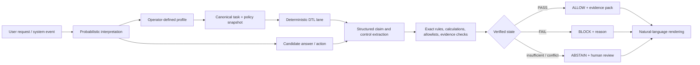

# EU AI Act DTL

## A deterministic evidence layer for probabilistic AI

**Status:** reference architecture and engineering demonstrator
**Version:** 1.0
**Research cut-off:** 13 August 2026 (Australia/Sydney)
**Legal boundary:** this document is not legal advice, a legal classification,
a conformity assessment, a certification, or a declaration of compliance.

## Executive summary

The EU AI Act is not a single checklist. It is a role-, purpose-, risk- and
context-dependent regulation. The same base model can sit inside a low-risk
chat experience, a transparency-triggered generative system, a high-risk
employment workflow, or a general-purpose AI model supply chain. The legal
answer changes with those facts.

DTL is useful at a different layer: it makes the system's **accepted semantic
state** deterministic. A model can still interpret, explore and generate
probabilistically, but it cannot turn a probabilistic candidate into an
accepted control, decision or action until the candidate survives an explicit
verification lane.

The core invariant is:

```text
same canonical task + same evidence + same policy/state
    = same accepted semantic result
```

DTL does not claim to solve the whole EU AI Act. It supplies an evidence and
decision boundary that can support several obligations:

- identify the intended use and applicable operator role;
- route to a declared legal/product lane;
- bind the candidate to the evidence and policy state used;
- verify structured controls deterministically;
- fail closed, abstain, or request human review when required;
- seal a replayable record of the result and limitations;
- render natural language only after the canonical result exists.

## What changed in the current legal landscape

The Act applies progressively. The official implementation timeline currently
records: entry into force on 1 August 2024; general provisions, AI literacy and
prohibitions from 2 February 2025; GPAI rules and governance from 2 August
2025; the majority of rules, Article 50 transparency and enforcement of the
applicable rules from 2 August 2026; a transition for certain pre-existing
synthetic-content systems on 2 December 2026; high-risk Annex III rules on 2
December 2027; and regulated-product high-risk rules on 2 August 2028. The
timeline notes amendments introduced by the Digital Omnibus on AI, so dates and
scope must be rechecked before each release.

Sources: [official implementation timeline](https://ai-act-service-desk.ec.europa.eu/en/ai-act/eu-ai-act-implementation-timeline),
[Regulation (EU) 2024/1689](https://eur-lex.europa.eu/eli/reg/2024/1689/oj?locale=en).

Article 50 now applies from 2 August 2026. The Commission's current guidance
states that providers must inform people when they interact directly with an
AI system and add machine-readable marks for AI-generated or manipulated
content; deployer obligations also cover specified deepfakes, biometric or
emotion-recognition exposure, and certain public-interest text publications.

Sources: [Article 50 transparency guidance](https://digital-strategy.ec.europa.eu/en/policies/guidelines-ai-transparency-obligations),
[Article 50 FAQ](https://digital-strategy.ec.europa.eu/en/faqs/transparency-obligations-under-article-50-ai-act),
[transparency code of practice](https://digital-strategy.ec.europa.eu/en/policies/code-practice-ai-generated-content).

The Commission's high-risk guidance is non-binding and reflects the
Commission's interpretation. It is useful for implementation planning, but it
does not replace the Regulation, a competent-authority position, or legal
advice. The guidance currently reflects a revised high-risk timeline following
the Digital Omnibus.

Source: [high-risk systems guidance](https://digital-strategy.ec.europa.eu/en/policies/guidelines-ai-high-risk-systems).

## The DTL boundary



The model's confidence is metadata. It is never a substitute for a passed
control. Repeatedly generating the same wrong answer is deterministic
repeatability, not deterministic correctness.

## Responsibility model

DTL must keep these responsibilities separate:

| Question | Who/what answers it? | DTL boundary |
|---|---|---|
| Is this the provider, deployer, importer, distributor, downstream provider, or another role? | Operator and legal/product review | Store the declared role and version it; do not infer it from confidence. |
| Is the intended purpose high-risk under Article 6 and Annex III, or changed by a later modification? | Operator, domain owner and legal review | Require a classification record and route the declared result. |
| Is a use prohibited under Article 5? | Policy and legal review | Enforce a pre-use block lane and retain the policy/evidence used. |
| What exactly did the model propose? | Probabilistic model | Normalize into structured claims/fields before acceptance. |
| Did the candidate satisfy the fixed control? | Deterministic verifier | Return PASS, FAIL or INCOMPLETE with a reason. |
| Is a human required to review or override? | System policy and responsible operator | Make the review state explicit; never hide it behind wording. |
| Does the product meet the Act overall? | Provider/deployer and qualified legal/compliance function | DTL reports readiness evidence, never certification. |

## Control-by-control mapping

The matrix below describes technical support, not legal fulfilment. “DTL
contribution” means the type of evidence or gate DTL can provide. It does not
mean the control is complete.

| Act area | Problem the Act addresses | DTL contribution | Required evidence outside the verifier | Status in this reference |
|---|---|---|---|---|
| Articles 2–3 | Scope, definitions, role and context ambiguity | Versioned product profile, jurisdiction, intended purpose and operator role | Legal scope memo, contracts, market-placement facts | Operator input required |
| Article 4 | People using or operating AI may lack suitable AI literacy | Role-bound training record IDs and review gates | Training plan, attendance, competency records | Evidence interface |
| Article 5 | Prohibited manipulation, exploitation or other banned practices | Fail-closed prohibited-practice screen before serving or acting | Policy catalogue, test suite, legal review, abuse monitoring | Partial reference lane |
| Articles 6–7 / Annex III | Misclassification of high-risk intended purposes | Classification record becomes a routing/state input, not a model guess | Annex III analysis, exceptions analysis, legal sign-off | Operator input required |
| Article 9 | High-risk risk management must be continuous and documented | Risk-state hash, residual-risk gate, change-triggered revalidation | Risk register, metrics, foreseeable misuse analysis, mitigations | Partial |
| Article 10 | Training/validation/test data quality and governance | Data provenance and freshness fields; input completeness gate | Dataset governance, representativeness, bias/quality analysis | Partial |
| Article 11 | Technical documentation must describe the system | Pinned model/ruleset versions, lane manifest and evidence export | Annex IV technical file, architecture, evaluation results | Partial |
| Article 12 | High-risk operation must be traceable | Hash-chained request, route, control and verdict record | Retention, access, deletion, security and export policy | Strong technical support |
| Article 13 | Deployers need understandable capabilities and limitations | Canonical result plus limitations and reason codes | Instructions for use, contact details, known failure modes | Partial |
| Article 14 | Human oversight must be effective | Abstain state, escalation queue, role-bound approval, stop/override events | Human oversight procedure, staffing, training and authority | Strong technical support |
| Article 15 | Accuracy, robustness and cybersecurity over the lifecycle | Deterministic test harness, replay mismatch, fail-closed control | Domain metrics, adversarial tests, security programme, monitoring | Partial; verifier is not proof of model accuracy |
| Articles 16–21 | Provider lifecycle, quality, records, corrective action and cooperation | Release manifest, signed evidence pack, change/revalidation triggers | QMS, conformity assessment, corrective action and authority process | Partial |
| Article 25 | Value-chain changes can move responsibility to another provider | Immutable intended-purpose and modification history | Supplier agreements, technical access and role allocation | Evidence interface |
| Article 26 | Deployer instructions, monitoring, human oversight and incident handling | Deployer-scoped runtime logs, monitoring provenance and escalation | Instructions, monitoring plan, input governance, incident procedure | Partial |
| Article 27 | Certain deployers need a fundamental-rights impact assessment | FRIA record ID, affected-group fields, mitigation and update trigger | Completed FRIA, notification, DPIA relationship and governance | Evidence interface |
| Article 50(1) | People should know when directly interacting with AI | Deterministic disclosure control and output metadata | UX copy, accessibility, placement and user testing | Demonstrated |
| Article 50(2) | Synthetic/manipulated content must be machine-detectable in relevant cases | Provenance/marking state, media marker test and hash | Marking implementation, detection tests, code-of-practice or equivalent evidence | Partial |
| Article 50(4–5) | Deepfakes and certain biometric/emotion/public-interest content can mislead | Output-type and trigger routing; block if required label is missing | Content classification, editorial review and notices | Partial |
| Articles 51–54 | GPAI providers need documentation, copyright policy and training-summary information | Model identity/version manifest, source registry and evidence export | GPAI technical docs, copyright policy, public training-content summary | Provider-role dependent |
| Article 55 | GPAI systemic-risk providers need risk, incident and cybersecurity controls | Systemic-risk evidence ledger and incident/replay records | Model-scale assessment, risk mitigation, reporting and cybersecurity | Provider-role dependent |
| Article 72 | High-risk post-market monitoring must be active and systematic | Monitoring event ledger, drift/replay mismatch and revalidation trigger | Post-market monitoring plan and lifetime performance data | Partial |
| Article 73 | Serious incidents need timely reporting and investigation | Incident ID, immutable timeline, evidence preservation and export | Causal investigation, authority report, corrective action | Evidence interface |
| Articles 74–84 | Market surveillance, confidentiality and corrective enforcement | Exportable, scoped, reviewable evidence without exposing unrelated tenants | Authority interface, confidentiality controls, response process | Partial |
| Article 99 | Penalties make inaccurate claims and missing controls expensive | ClaimLint-style wording checks, evidence completeness and “not certified” boundary | Legal/compliance programme and jurisdiction-specific advice | Risk reduction only |

Primary legal text and the official article explorer: [EUR-Lex](https://eur-lex.europa.eu/eli/reg/2024/1689/oj?locale=en),
[AI Act Explorer](https://ai-act-service-desk.ec.europa.eu/en/ai-act-explorer).

## How DTL fixes the recurring failure modes

### 1. Model confidence is mistaken for compliance

**Failure:** a model says “this is compliant” with 99% confidence.
**DTL fix:** confidence is stored as non-authoritative metadata. Acceptance reads
only from structured controls and declared evidence.

### 2. The system silently changes its legal lane

**Failure:** a generic chat route is used for employment, credit, health,
education or public-service decisions without recognizing the change in
intended purpose.
**DTL fix:** intended purpose, affected group, jurisdiction and role are part of
the canonical task hash. A material change invalidates the prior evidence and
requires re-routing.

### 3. A checklist says “done” without proof

**Failure:** a spreadsheet checkbox is treated as evidence.
**DTL fix:** each control has an evidence reference, version, timestamp,
provenance and verifier result. Missing evidence is `OPEN_EVIDENCE_GAP`, not
green.

### 4. One model judges another model

**Failure:** AI output is accepted because a second model preferred it.
**DTL fix:** use deterministic parsers, exact calculations, allowlists,
schema checks, policy evaluation, replay comparison and human escalation.

### 5. Disagreement is hidden

**Failure:** repeated candidates conflict and the system silently picks one.
**DTL fix:** canonicalize each candidate, compare semantic claims and classify
the conflict as deterministic winner, multiple valid results, insufficient
evidence or incomplete lane rules.

### 6. Evidence cannot be replayed

**Failure:** the organisation has a screenshot but not the inputs, rules or
versions that produced it.
**DTL fix:** seal the canonical task, policy snapshot, evidence references,
ruleset version and result hash. Replay returns `MATCH`, `DRIFT`, `MISSING_INPUT`
or `UNSAFE_REPLAY`.

### 7. The verifier overclaims

**Failure:** “passed Article 15” is presented as “the AI Act is satisfied.”
**DTL fix:** distinguish `system_support`, `evidence_present`, `human_reviewed`
and `legal_classification_required`. The public API only exposes readiness
mapping, never a compliance verdict.

## Evidence pack minimum

Every accepted or rejected result should be able to answer:

```json
{
  "schema": "eu-ai-act-dtl.evidence/v1",
  "canonical_task": {},
  "intended_purpose": "",
  "operator_role": "provider|deployer|downstream_provider|other",
  "jurisdiction_state": {},
  "classification_record": {},
  "policy_snapshot": {"id": "", "version": "", "sha256": ""},
  "model_state": {"provider": "", "model": "", "version": ""},
  "input_state_sha256": "",
  "candidate_claims": [],
  "control_results": [],
  "human_review": {},
  "verification_state": "PASS|FAIL|INCOMPLETE|ABSTAIN",
  "canonical_result_sha256": "",
  "limitations": [],
  "replay_instructions": {},
  "created_at": ""
}
```

Do not put unnecessary personal or sensitive data into an evidence pack. Use
references, scoped access and redaction where possible. Hashing is integrity
evidence; it is not encryption, anonymisation, lawful processing, or proof of
truth.

## Safety and threat model

DTL itself has failure modes:

| Threat | Mitigation | Residual risk |
|---|---|---|
| Wrong legal profile supplied | Required profile fields, review status, change history | A verifier cannot correct a wrong legal premise by itself |
| Candidate claims are mis-extracted | Structured schema, parser tests, conflict detection | Natural language remains ambiguous |
| Evidence is stale or forged | Version pinning, provenance, signed/hash-chained packs, replay | A compromised source can still produce bad evidence |
| Rules are incomplete | `LANE_INCOMPLETE` / `ABSTAIN`, coverage tests, external review | Unknown legal edge cases remain |
| Replay executes unsafe commands | Allowlisted, offline or sandboxed replay; no arbitrary shell by default | Operational environment can still change |
| Personal data is over-collected | Data minimisation, scoped packs, retention/access controls | Compliance requires organisational controls outside DTL |
| Operators treat PASS as certification | Hard wording boundary, ClaimLint, public limitations | Human misuse is not eliminated |
| Version drift changes verdicts | Input/policy/ruleset hashes and replay mismatch | Some external APIs are nondeterministic |

## 100x roadmap

### 1. Make the public proof undeniable

- Keep the demo under 200 lines of dependency-free code.
- Publish fixed positive, negative, conflict and insufficient-evidence cases.
- Add a JSON Schema and a replay fixture for every case.
- Publish measured latency with hardware, Python version and exact commit.
- Add a “what this does not prove” section to every public gate.

### 2. Build a real compliance evidence product

- Add a signed control registry with article, applicability, owner, evidence
  type, cadence and review status.
- Add provider/deployer/GPAI role workspaces.
- Add evidence expiry and revalidation triggers.
- Add a human review queue with two-person approval for configured lanes.
- Add machine-readable Article 50 output metadata and media marking adapters.
- Add incident, corrective-action and post-market monitoring workflows.

### 3. Win trust through independent verification

- Publish a threat model and reproducible conformance suite.
- Invite external legal, safety, security and academic reviewers.
- Never publish unsupported “first,” “certified,” or “100% compliant” claims.
- Separate open reference code from proprietary tenant, billing and model
  infrastructure.
- Maintain a changelog when Commission guidance, codes of practice or the Act's
  implementation timeline changes.

### 4. Productise the boundary, not the slogan

The commercial unit is not “AI compliance by magic.” It is:

```text
declared scope
    + evidence collection
    + deterministic control execution
    + human review
    + replay and drift detection
    + exportable audit pack
```

That is a defensible product proposition because each part can be demonstrated,
measured and challenged independently.

## Claim policy

Allowed:

- “DTL provides a deterministic evidence and verification layer.”
- “This lane blocks a candidate when the declared control is missing.”
- “The result is replayable for the same canonical state.”
- “The implementation maps technical controls to selected AI Act articles.”

Not allowed without independent legal and technical substantiation:

- “JARVI3 is EU AI Act certified.”
- “DTL makes any AI system compliant.”
- “A PASS proves safety, fairness, accuracy or legal conformity.”
- “The model is deterministic.”
- “This is a substitute for a notified body, authority, lawyer or domain expert.”

## Conclusion

The next era is not a deterministic language model. It is a probabilistic model
inside a deterministic acceptance boundary. DTL gives the boundary a canonical
task, explicit lane, evidence state, verifier, human escalation path and replay
receipt.

That can make AI governance more inspectable. It cannot remove the need for
classification, domain expertise, organisational controls, legal review or
competent-authority oversight. The public project should earn trust by making
those limits visible.
