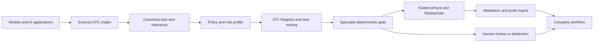

# EcoKure DTL

## Deterministic verification infrastructure for AI-enabled operations

[](https://github.com/kyal102/eu-ai-act-dtl/actions/workflows/ci.yml)
[](https://github.com/kyal102/eu-ai-act-dtl/releases)

EcoKure DTL is an enterprise verification and evidence platform for systems
that use probabilistic AI to produce recommendations, decisions, content or
actions.

The platform separates two responsibilities:

- **AI systems interpret, reason, generate and explore.**
- **DTL determines what may be accepted, served, recorded or acted upon.**

The language may vary. The accepted semantic state does not vary when the
canonical task, evidence, policy and state are identical.

```text
request or system event
    -> probabilistic interpretation
    -> canonical task and state
    -> deterministic DTL lane
    -> specialist gate and policy checks
    -> evidence pack and attestation
    -> ALLOW / BLOCK / ABSTAIN / HUMAN REVIEW
    -> natural-language or system rendering
```

This repository is the public EU AI Act application pack and a dependency-free
reference verifier for the broader EcoKure DTL architecture. It is not a legal
certificate, conformity assessment, notified-body service or substitute for a
company's legal, safety, security and governance responsibilities.

## The enterprise problem

Organisations are putting probabilistic systems into workflows where an answer
can become a customer communication, a security decision, an engineering
change, a clinical recommendation or a regulated record. Common controls fail
when they:

- treat model confidence as evidence;
- ask another model to approve the first model;
- lose the policy, data and ruleset used for the decision;
- silently route a request into the wrong risk or domain lane;
- accept conflicting candidates without recording the disagreement;
- retain a screenshot instead of a replayable evidence record; or
- confuse a passing test with a legal, scientific, medical or operational
  guarantee.

EcoKure DTL provides the acceptance boundary around those systems.

## EcoKure DTL capability model

| Capability | Enterprise function | Evidence produced |
|---|---|---|
| Probabilistic transition | Converts a request and candidate outputs into a canonical task, relevance state, lane and candidate set | Canonical task, input/evidence/policy/state hashes, disagreement state |
| DTL taxonomy lanes | Stores reusable, domain-specific verification knowledge with explicit trigger, patch boundary and promotion rules | Versioned lane pack, gate contract and promotion record |
| Deterministic specialist gates | Runs exact rules, calculations, schema checks, allowlists, attack corpora or domain verifiers | Structured verdict and reason codes |
| Claim control | Extracts claims from generated text and routes them to the gate that can verify them | Verified, refuted or unverifiable claim records |
| EvidencePack | Seals input, normalized state, result, code/data versions, limitations and reproduction instructions | Stable certificate and evidence-pack hashes |
| ReplayGate | Re-executes a sealed result and detects drift, missing inputs or unsafe replay | Replay match or drift verdict |
| Attestation | Signs certificate hashes and maintains a tamper-evident hash chain | Offline-verifiable signature, public key and chain position |
| Application safety guard | Applies fail-closed checks at sensitive sinks such as paths, SQL values, HTML, URLs, redirects and shell arguments | Safe, malicious or abstain decision |
| Registry and tenancy | Keeps verified lanes private by tenant unless explicitly bridged, with access control and provenance | Tenant-scoped route, ownership and bridge records |
| Enterprise metering | Exposes one partner API boundary, gate access controls, usage metering and subscription allowances | Usage records and plan/bundle state |
| Domain generalisation | Provides research and preview lanes for security, medical decision support, hardware, orbital, biological and other domains | Domain-specific test evidence with explicit maturity limits |

The central product is not a chat response. It is a governed, replayable and
auditable state transition.

## Gate portfolio

The public platform catalog separates established deterministic services from
preview or research services. That distinction is part of the product's trust
model.

| Gate or service | What it verifies | Public maturity boundary |
|---|---|---|
| SuperMath | Exact integer/rational, symbolic and calculus calculations with proof-oriented results | Deterministic math service; not a general scientific truth engine |
| UnitGate | Dimensional consistency of equations and quantities | Deterministic unit checks; domain interpretation remains external |
| ElementGate | Chemical formulae, molar mass and reaction balancing | Deterministic chemistry calculations; not laboratory validation |
| ClaimGate | Claim extraction and routing to an applicable verifier | Unverifiable claims remain unresolved |
| ClaimLint | Unsupported, over-claiming or unsafe wording detection | Wording control; not legal approval |
| EvidencePack | Hashes and seals a structured verification artifact | Preserves what was checked; does not prove reality by itself |
| ReplayGate | Replays a sealed artifact and detects divergence | Reproducibility check; external dependencies can still change |
| SecurityGate | OWASP-family vulnerability classification and guarded/fixed-mode checks | Software security evidence; not a complete security programme |
| MedGate | Rule-based clinical decision-support checks such as interactions, dosing and scores | Integration evaluation only; not a registered medical device or care decision |
| ChipGate | RTL structural safety patterns, passport and benchmark evidence | Early access/preview; not silicon readiness or physical safety |
| OrbitGate | Conjunction and collision-risk research lanes | Research preview; not flight software or certification |
| DiscoveryGate / BioGate | Protein-fold, binding-site and mutation research lanes | Research demonstration; not a biomedical conclusion |
| Research Taxonomy | Cross-domain lane packs and training interfaces | Demonstrates generalisation; each domain requires its own validation |

## Company deployment model

EcoKure DTL can sit between a company's AI applications and its operational
systems, or run as a partner verification service.



Typical integration patterns are:

1. **API boundary:** an application submits a candidate and receives a
   structured verdict, certificate and evidence reference.
2. **SDK/registry integration:** an engineering team embeds lane routing,
   tenant access and verification into an internal platform.
3. **Customer-controlled verification:** the customer runs the deterministic
   verifier and exports signed evidence to its own governance system.
4. **Enterprise control plane:** workspaces, roles, model inventories,
   approvals, monitoring, connectors and signed audit exports surround the
   DTL runtime.

## EU AI Act application pack

The EU AI Act is one governed EcoKure DTL application, not the definition of
the whole platform. This pack maps selected obligations to technical evidence
interfaces:

- operator role, intended purpose, jurisdiction and classification state;
- Article 4 AI-literacy evidence;
- Article 5 prohibited-practice screening;
- high-risk controls for risk management, data governance, documentation,
  traceability, transparency, human oversight and accuracy/robustness;
- Article 26 deployer controls and Article 27 assessment evidence;
- Article 50 transparency and output-marking states;
- GPAI provider documentation and systemic-risk evidence where applicable;
- Article 72 monitoring, drift and revalidation records; and
- Article 73 incident timelines and exportable evidence.

The verifier returns readiness evidence and deterministic control states. It
does not decide the legal classification for the operator and does not issue a
compliance verdict.

Read the [company brief](ECOKURE_DTL_COMPANY_BRIEF.md), the
[enterprise architecture and implementation guide](EU_AI_ACT_DTL_WHITEPAPER.md)
and the [official source register](RESEARCH_SOURCES.md).

## Run the public reference verifier

```bash
python eu-ai-act-dtl/eu_ai_act_dtl.py eu-ai-act-dtl/example.json
python -m unittest discover -s eu-ai-act-dtl -p "test_*.py"
```

The example deliberately gives a candidate high confidence while omitting a
required transparency control. DTL blocks the candidate. Changing the
declared control to `true` produces an `ALLOW` for the corrected state.

The verifier's core contract is:

```text
same task + same evidence + same policy/state = same accepted result
```

Confidence is retained as metadata. It never overrides missing evidence,
failed controls, lane incompleteness or candidate disagreement.

## Product boundary

EcoKure DTL can provide deterministic verification infrastructure, evidence
preservation, replay, attestation and governance integration. It does not by
itself provide:

- legal classification or an EU AI Act certificate;
- proof that a model is fair, safe, accurate or scientifically correct;
- a notified-body conformity assessment;
- a complete quality-management, privacy, cybersecurity or incident-response
  programme; or
- permission to deploy a domain-specific system without qualified review.

For the formal legal position, consult the [Regulation (EU) 2024/1689 on
EUR-Lex](https://eur-lex.europa.eu/eli/reg/2024/1689/oj?locale=en) and qualified
professionals.

Built from the JARVI3 / EcoKure DTL implementation. Public code is a reference
surface; enterprise operations, private lane registries, tenancy, support,
connectors and commercial terms are deployment-specific.
